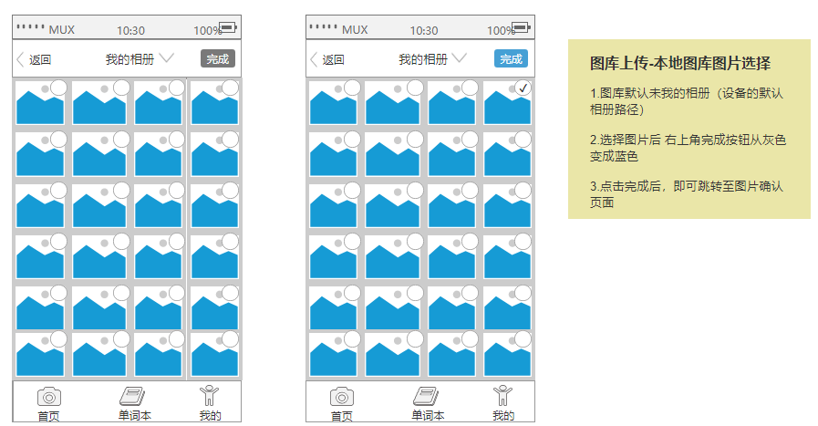
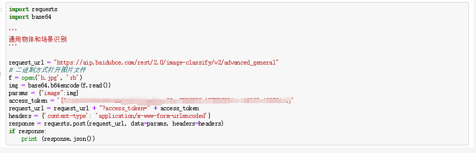

# 项目名称：幼儿拍照识物基础教育APP

项目名称 | 幼儿拍照识物基础教育APP
---|---
发布日期 | 2019-12-04
文件现状 | 进行中
文件拥有者 | 杨幸
设计者 | 杨幸
开发者 | 杨幸

## 市场
- 目前市面上针对幼年儿童的汉语和英语基础学习、教育类APP较少且不出众
- 多数汉语和英语的基础教育依存于课本和网课，而这些课程都要求幼年儿童在学习时拥有一定强度的注意力，不符合改年龄层的学习习惯

## 产品定位：
本产品旨在为5-10岁的儿童提供一个入门、学习和提升汉语和英语能力的平台，让幼儿的学习更加贴近生活。

## 目标用户：
- 5-10岁的学前和学龄幼儿及其家长
- 幼儿早教机构
- 有汉语和英语学习需求的幼儿
- 学习兴趣低下的幼儿

## PRD1.加值宣言
百度API中，通用物体识别、语音合成的功能和有道智云的文本翻译api的功能。
- 通用物体识别：用户对某个物品进行拍照，app识别此物品，并且反馈这个物品的汉语的名称。
- 文本翻译：app反馈汉语名称的同时，将其翻译成英语。
- 语音合成：用户点击汉语或英语名称时，利用语音合成的功能，分别播放发音。

## PRD2.核心价值
最小完成项（核心功能）

利用通用物体识别、文本翻译、语音合成的功能，为幼儿提供在生活中拍照就可以学习汉语和英语基础词汇及其发音，让幼儿的学习更加贴近生活。

## PRD3.核心价值与用户痛点

 \ | 痛点场景
---|---
1 | 一位幼儿突然想知道家中客厅某件物品的英文名称，他需要找别人问或是自己查，过程很麻烦
2 | 家长A被孩子A问到某件物品的英文，但是此家长不会英文
3 | 家长B需要辅导孩子B进行基本的英语词汇学习，可是他的发音不标准
4 | 家长C想让孩子用C书本学习标准的普通话和英语，但是孩子C觉得很枯燥抗拒学习

#### 此产品的优势在于：
- 生活化

幼儿可以利用碎片时间在生活中进行学习，在放松中参与获得知识。

- 针对性

市场上的教育软件没有针对儿童设定教育内容。而本产品可以根据用户拍照识图形成学习的内容，巩固学习，加深记忆，并且定时反馈学习内容。同时，避免家长教育时发音不准确，幼儿学习枯燥的问题。

- 参与性

幼儿学习通常以老师或父母口头传授为主，而拍照识物会让幼童激发学习兴趣，提高主动学习的积极性。同时，增加家长和幼儿之间的学习互动，让家长更加了解幼儿的学习习惯。

## PRD4.人工智能概率性与用户痛点

- 用户拍照时灯光太暗、图片质量不清晰导致无法识别物体
- 反馈的不是用户所拍照的物体，而是其他相似物体。
- 识别到图片中的其他物体，而不是主物体。
- 文本翻译时，所翻译的英文可能是不适合幼儿学习的高级词汇。

## PRD5.需求列表与人工智能API加值

\ | 用户案例 | 重要性 | 接口
---|---|---|---
1 | 拍照认识某物体的中文和英文名称 | 很重要 | 通用物体识别、文本翻译
2 | 听某物体中文和英文名称的发音 |很重要 | 文本翻译、语音合成
3 | 反馈学习情况 | 次重要 | 无涉及API

#### 用户需求
1. 培养幼儿学习的兴趣，激发学习动力
2. 幼儿学习基础汉语、英语词汇和发音
3. 避免幼儿的学习枯燥，在生活中学习
4. 巩固学习内容，培养幼儿学习习惯
5. 培养和练习标准汉语和英语发音
6. 家长对幼儿学习的陪伴和了解

# 二、产品原型

## 产品架构图

## 产品流程图

## 原型1.交互及界面设计 5%
- 百度ai的通用物体识别：首页中拍照识别，并返回中文名称使用到
- 有道智云的文本翻译：在识图成功后，将返回的中文翻译成英文和返回相关例句
- 百度ai的语音合成，在识图成功后，将返回的中英文名称转成音频；在基本设置可选择声音的选项。

## 原型2.信息设计 5%
 
 
 
 
 
 
 
 

## 原型3.原型文档 5%

# 三、API的输出入展示

## API1.使用水平

- 通用物体识别
**调用输入**

**调用输出**

输入：图片 → 输出：文字

- 文本翻译
**调用输入**

**调用输出**

输入：文字（中文） → 输出：文字（英文）

- 语音合成
**调用输入**

**调用输出**

输入：文字 → 输出：音频

[通用物体识别api使用文档](code/通用物体识别API文档.ipynb)
[文本翻译api使用文档](code/文本翻译api文档.ipynb)
[语音合成api使用文档](code/语音合成api文档.ipynb)

## API2.使用比较分析

1. 阿里云的图像识别与百度的通用物体识别

---|阿里云图像识别 | 百度通用物体识别
---|---|---
产品优势 | 1.可识别上千种标签，覆盖日常生活各种场景；2.快速高效的识别，提供准确的识别结果；3.大量训练数据支撑，不断迭代优化的识别质量。| 1.准确性高，基于百度海量数据，利用深度学习技术及高精度算法不断迭代模型，准确率业界领先。2.标签体系丰富，可识别出10万+物体及场景标签，并在不断丰富中，持续提供更精细的识别服务。3.简单易用，支持标准化接口封装，调用简单，只需上传单张图片，即可获取识别结果
产品服务 | 图片打标和场景识别 | 图片内容分析与推荐、拍照识图、拍照闯关趣味营销

识别的准确度

**阿里云图像识别**

**百度通用物体识别**

**总结：**
百度api的通用物体识别的结果更为准确，且识别出的物体也比阿里云的图像识别要高。百度通用物体识别中拍照识物功能更符合本项目的需求。

2. 有道智云文本翻译api与微软AZURE文本翻译api

微软AZURE文本翻译api需要涉及环境变量，而且需要安装新的模块。

**而有道智云文本翻译api相对操作步骤比较简单。产品优势有离线翻译和离线查词。接入方式较为灵活。新用户有50元的免费体验金，相对性价比较高。**

3.语音合成

## API3.使用后风险报告

#### API使用价格
**1. 百度-通用物体识别**

免费额度：每日500次，免费额度用完后开始计费，价格如下：

月调用量（万次） | 通用物体和场景识别高级版（元/千次）
---|---
0<月调用量<=300 | 3
300<月调用量 | 2

> 调用失败不计费

**2. 百度语音合成**

**免费额度**
语音合成接口免费QPS额度如下：

接口服务|未认证账户	| 个人认证 | 企业认证
--- | --- |---| ---
精品音库 |2QPS|3QPS|5QPS
基础音库|5QPS|10QPS|100QPS

在线语音合成QPS购买为预付费机制，QPS可按年、按月、按天灵活购买扩充，具体价格如下：

购买QPS数量|按年购买|按月购买|按天购买
--- | --- |---| ---
0<QPS<=50|10000元/年/QPS|1000元/月/QPS	| 70元/天/QPS
50<QPS<=100	|8000元/年/QPS	|800元/月/QPS|	55元/天/QPS
100<QPS<=500|	6000元/年/QPS|	600元/月/QPS|	40元/天/QPS

**3.有道智云文本翻译**

**免费体验**

对于自然语言翻译服务，各接口拥有一定量的免费查询字符数（新用户注册账户时，系统会向您账户赠予50元体验资金），可免费体验有道智云的服务。

服务配置

单次查询最大字符数 | 每小时最大查询次数
---|---
5000 | 	100万

> 说明
- 先消费体验金额，体验金额耗尽后，才根据接口调用量在账户余额进行扣费。

- 单次查询最大字符数默认为5000、每小时最大查询次数默认为100万。

服务内容	

计费方式 | 服务内容 | 价格（元/百万字符）
---|--- |---
按月调用字符数 | 中文与其他语种间互译 | 语种一：48、语种二：100
按月调用字符数 | 其他语种间互译 | 100

## API4.加分项

[通用物体识别api使用文档](code/通用物体识别API文档.ipynb)
[文本翻译api使用文档](code/文本翻译api文档.ipynb)
[语音合成api使用文档](code/语音合成api文档.ipynb)
